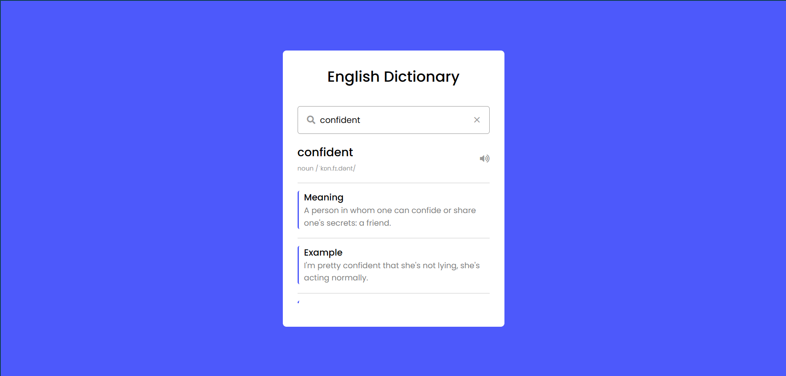

# Dicionary

## Available Scripts

In the project directory, you can run:

## 🔨 Funcionalidades do projeto

É um projeto que usa api de dicioanario em ingles para vê o significados das palavras e ouvir a pronuncia.

